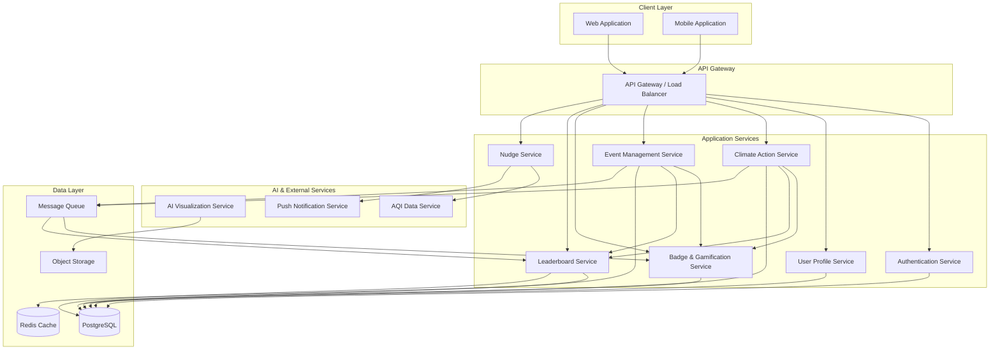

# Design Document: FuturePulse Platform

## Overview

FuturePulse is a full-stack web and mobile application that combines AI-powered visualizations, real-time environmental data, gamification mechanics, and community coordination to motivate urban youth toward climate action. The platform architecture follows a microservices approach with clear separation between the AI processing pipeline, real-time notification system, gamification engine, event management, and user-facing applications.

The system is designed for scalability to support thousands of concurrent users across multiple campuses, with real-time updates for leaderboards and notifications. The architecture prioritizes user experience with fast response times (<2s for most operations), reliable AI processing, and seamless mobile/web experiences.

## Architecture

### High-Level Architecture



### Technology Stack

**Frontend:**
- Web: React with TypeScript, TailwindCSS for styling
- Mobile: React Native for cross-platform iOS/Android support
- State Management: Redux Toolkit with RTK Query for API integration
- Real-time Updates: WebSocket connections for live leaderboard and notifications

**Backend:**
- API Gateway: Node.js with Express or NestJS
- Services: Node.js/TypeScript microservices
- Authentication: JWT tokens with refresh token rotation
- Message Queue: RabbitMQ or AWS SQS for async processing

**AI & ML:**
- AI Visualization: Python service using Stable Diffusion or similar generative AI models
- Image Processing: OpenCV for preprocessing
- Model Hosting: GPU-enabled containers (AWS SageMaker or similar)

**Data Storage:**
- Primary Database: PostgreSQL for relational data (users, events, actions, badges)
- Cache: Redis for leaderboards, session management, and frequently accessed data
- Object Storage: AWS S3 or similar for photos and generated visualizations
- Search: Elasticsearch for event and user search functionality (optional enhancement)

**External APIs:**
- AQI Data: IQAir API, OpenWeatherMap, or government environmental APIs
- Push Notifications: Firebase Cloud Messaging (FCM) for mobile, Web Push API for web
- Email: SendGrid or AWS SES for transactional emails
- Maps: Google Maps API or Mapbox for location services

## Components and Interfaces

### 1. Authentication Service

**Responsibilities:**
- User registration and email verification
- Login/logout with JWT token management
- Password reset and account recovery
- Session management and token refresh

**Key Interfaces:**

```typescript
interface AuthService {
  register(userData: RegisterRequest): Promise<AuthResponse>
  verifyEmail(token: string): Promise<VerificationResult>
  login(credentials: LoginRequest): Promise<AuthResponse>
  logout(userId: string, token: string): Promise<void>
  refreshToken(refreshToken: string): Promise<TokenPair>
  requestPasswordReset(email: string): Promise<void>
  resetPassword(token: string, newPassword: string): Promise<void>
}

interface RegisterRequest {
  email: string
  password: string
  name: string
  campusId: string
  location: GeoLocation
}

interface AuthResponse {
  user: UserProfile
  accessToken: string
  refreshToken: string
  expiresIn: number
}

interface TokenPair {
  accessToken: string
  refreshToken: string
  expiresIn: number
}
```

### 2. AI Visualization Service

**Responsibilities:**
- Process uploaded photos
- Generate future climate impact visualizations
- Manage AI model inference pipeline
- Store and retrieve generated images

**Key Interfaces:**

```typescript
interface AIVisualizationService {
  processPhoto(photoData: PhotoUpload): Promise<VisualizationJob>
  getJobStatus(jobId: string): Promise<JobStatus>
  getVisualization(jobId: string): Promise<VisualizationResult>
  cancelJob(jobId: string): Promise<void>
}

interface PhotoUpload {
  userId: string
  imageData: Buffer
  location?: GeoLocation
  metadata?: ImageMetadata
}

interface VisualizationJob {
  jobId: string
  status: 'queued' | 'processing' | 'completed' | 'failed'
  estimatedCompletionTime: Date
}

interface VisualizationResult {
  jobId: string
  originalImageUrl: string
  scenarios: ClimateScenario[]
  generatedAt: Date
}

interface ClimateScenario {
  timeframe: number // years in future
  imageUrl: string
  description: string
  impactFactors: string[]
}
```

### 3. Nudge Service

**Responsibilities:**
- Fetch real-time AQI data for user locations
- Generate personalized nudge messages
- Schedule and deliver notifications
- Track nudge engagement

**Key Interfaces:**

```typescript
interface NudgeService {
  fetchAQIData(location: GeoLocation): Promise<AQIData>
  generateNudge(userId: string, aqiData: AQIData): Promise<Nudge>
  scheduleNudges(userIds: string[]): Promise<void>
  deliverNudge(nudge: Nudge): Promise<DeliveryResult>
  trackEngagement(nudgeId: string, action: EngagementAction): Promise<void>
}

interface AQIData {
  location: GeoLocation
  aqi: number
  pollutants: PollutantLevel[]
  timestamp: Date
  source: string
}

interface Nudge {
  nudgeId: string
  userId: string
  message: string
  urgencyLevel: 'low' | 'medium' | 'high'
  actionSuggestions: string[]
  aqiContext: AQIData
  deliveryChannels: ('push' | 'in-app' | 'email')[]
}

interface DeliveryResult {
  nudgeId: string
  delivered: boolean
  channels: Record<string, boolean>
  timestamp: Date
}
```

### 4. Badge & Gamification Service

**Responsibilities:**
- Define and manage badge criteria
- Evaluate user actions for badge eligibility
- Award badges and track progress
- Calculate badge tiers and achievements

**Key Interfaces:**

```typescript
interface BadgeService {
  evaluateEligibility(userId: string, action: ClimateAction): Promise<BadgeAward[]>
  awardBadge(userId: string, badgeId: string): Promise<BadgeAward>
  getUserBadges(userId: string): Promise<UserBadge[]>
  getBadgeProgress(userId: string, badgeId: string): Promise<BadgeProgress>
  getAllBadges(): Promise<Badge[]>
}

interface Badge {
  badgeId: string
  name: string
  description: string
  category: 'action' | 'milestone' | 'consistency' | 'leadership'
  tier: number
  criteria: BadgeCriteria
  iconUrl: string
}

interface BadgeCriteria {
  type: 'action_count' | 'event_participation' | 'streak' | 'impact_threshold'
  threshold: number
  actionTypes?: string[]
  timeframe?: number // days
}

interface BadgeAward {
  awardId: string
  userId: string
  badgeId: string
  awardedAt: Date
  progress: number
}

interface UserBadge {
  badge: Badge
  awardedAt: Date
  progress: number
  nextTier?: Badge
}
```

### 5. Leaderboard Service

**Responsibilities:**
- Aggregate climate action scores by campus
- Maintain real-time rankings
- Support time-based filtering
- Handle tie-breaking logic

**Key Interfaces:**

```typescript
interface LeaderboardService {
  updateScore(campusId: string, points: number): Promise<void>
  getLeaderboard(timeframe: Timeframe, limit: number): Promise<LeaderboardEntry[]>
  getCampusRank(campusId: string, timeframe: Timeframe): Promise<RankInfo>
  recalculateLeaderboard(timeframe: Timeframe): Promise<void>
}

interface LeaderboardEntry {
  rank: number
  campusId: string
  campusName: string
  score: number
  memberCount: number
  lastActivityAt: Date
}

interface RankInfo {
  campusId: string
  rank: number
  score: number
  percentile: number
  pointsToNextRank: number
}

type Timeframe = 'weekly' | 'monthly' | 'all-time'
```

### 6. Event Management Service

**Responsibilities:**
- Create and manage clean-up and plant-and-network events
- Handle event registration and capacity
- Provide check-in and verification functionality
- Track event impact metrics

**Key Interfaces:**

```typescript
interface EventService {
  createEvent(eventData: CreateEventRequest): Promise<Event>
  updateEvent(eventId: string, updates: Partial<Event>): Promise<Event>
  deleteEvent(eventId: string): Promise<void>
  getEvent(eventId: string): Promise<Event>
  searchEvents(filters: EventFilters): Promise<Event[]>
  registerForEvent(userId: string, eventId: string): Promise<Registration>
  checkIn(userId: string, eventId: string): Promise<CheckInResult>
  submitImpactMetrics(eventId: string, metrics: ImpactMetrics): Promise<void>
}

interface CreateEventRequest {
  organizerId: string
  type: 'cleanup' | 'plant-and-network'
  title: string
  description: string
  location: GeoLocation
  startTime: Date
  endTime: Date
  capacity: number
  specificData: CleanupEventData | PlantEventData
}

interface Event {
  eventId: string
  organizerId: string
  type: 'cleanup' | 'plant-and-network'
  title: string
  description: string
  location: GeoLocation
  startTime: Date
  endTime: Date
  capacity: number
  registeredCount: number
  status: 'upcoming' | 'ongoing' | 'completed' | 'cancelled'
  specificData: CleanupEventData | PlantEventData
  createdAt: Date
}

interface CleanupEventData {
  targetArea: string
  equipmentProvided: string[]
  safetyGuidelines: string[]
}

interface PlantEventData {
  plantSpecies: string[]
  networkingTheme: string
  icebreakerPrompts: string[]
  availableSlots: number
}

interface ImpactMetrics {
  eventId: string
  wasteCollected?: number // kg
  areaCovered?: number // sq meters
  treesPlanted?: number
  participantCount: number
  photos: string[]
  notes: string
}
```

### 7. Climate Action Service

**Responsibilities:**
- Log and track user climate actions
- Calculate environmental impact metrics
- Verify actions requiring proof
- Maintain action history

**Key Interfaces:**

```typescript
interface ClimateActionService {
  logAction(actionData: LogActionRequest): Promise<ClimateAction>
  verifyAction(actionId: string, proof: ActionProof): Promise<VerificationResult>
  getUserActions(userId: string, filters?: ActionFilters): Promise<ClimateAction[]>
  getImpactSummary(userId: string): Promise<ImpactSummary>
  deleteAction(actionId: string): Promise<void>
}

interface LogActionRequest {
  userId: string
  actionType: ActionType
  timestamp: Date
  quantity?: number
  location?: GeoLocation
  notes?: string
  requiresVerification: boolean
}

type ActionType = 
  | 'recycling'
  | 'composting'
  | 'public_transit'
  | 'energy_saving'
  | 'advocacy'
  | 'event_participation'

interface ClimateAction {
  actionId: string
  userId: string
  actionType: ActionType
  timestamp: Date
  quantity?: number
  location?: GeoLocation
  notes?: string
  verified: boolean
  impactMetrics: ActionImpact
  createdAt: Date
}

interface ActionImpact {
  co2Saved: number // kg
  wasteDiverted: number // kg
  energySaved: number // kWh
  points: number
}

interface ImpactSummary {
  userId: string
  totalActions: number
  totalCO2Saved: number
  totalWasteDiverted: number
  totalEnergySaved: number
  totalPoints: number
  actionBreakdown: Record<ActionType, number>
}
```

## Data Models

### User and Authentication

```typescript
interface User {
  userId: string
  email: string
  passwordHash: string
  name: string
  campusId: string
  location: GeoLocation
  profilePhotoUrl?: string
  emailVerified: boolean
  accountStatus: 'active' | 'suspended' | 'deleted'
  preferences: UserPreferences
  createdAt: Date
  updatedAt: Date
}

interface UserPreferences {
  notificationsEnabled: boolean
  pushNotifications: boolean
  emailNotifications: boolean
  nudgeFrequency: 'high' | 'medium' | 'low'
  privacySettings: PrivacySettings
}

interface PrivacySettings {
  profileVisibility: 'public' | 'campus' | 'private'
  showOnLeaderboard: boolean
  shareLocation: boolean
}

interface GeoLocation {
  latitude: number
  longitude: number
  city?: string
  country?: string
}
```

### Campus

```typescript
interface Campus {
  campusId: string
  name: string
  type: 'school' | 'college' | 'university'
  location: GeoLocation
  emailDomain?: string
  administratorIds: string[]
  memberCount: number
  totalScore: number
  verified: boolean
  createdAt: Date
}
```

### Session Management

```typescript
interface Session {
  sessionId: string
  userId: string
  accessToken: string
  refreshToken: string
  expiresAt: Date
  createdAt: Date
  lastActivityAt: Date
  deviceInfo: DeviceInfo
}

interface DeviceInfo {
  deviceType: 'web' | 'ios' | 'android'
  userAgent: string
  ipAddress: string
}
```

### Badges and Achievements

```typescript
interface UserBadgeRecord {
  recordId: string
  userId: string
  badgeId: string
  progress: number
  completed: boolean
  awardedAt?: Date
  createdAt: Date
  updatedAt: Date
}
```

### Events and Registrations

```typescript
interface EventRegistration {
  registrationId: string
  eventId: string
  userId: string
  status: 'registered' | 'checked-in' | 'completed' | 'cancelled'
  registeredAt: Date
  checkedInAt?: Date
  slotNumber?: number // for plant-and-network events
}

interface TreeRecord {
  treeId: string
  eventId: string
  userId: string
  species: string
  location: GeoLocation
  photoUrl: string
  plantedAt: Date
  healthStatus?: 'healthy' | 'needs-care' | 'deceased'
}
```

### Leaderboard Cache

```typescript
interface LeaderboardCache {
  cacheKey: string // format: "leaderboard:{timeframe}"
  entries: LeaderboardEntry[]
  lastUpdated: Date
  ttl: number // seconds
}
```

### Notifications

```typescript
interface Notification {
  notificationId: string
  userId: string
  type: 'nudge' | 'badge_award' | 'event_reminder' | 'leaderboard_update'
  title: string
  message: string
  data: Record<string, any>
  read: boolean
  deliveredAt: Date
  readAt?: Date
}
```

## Correctness Properties

*A property is a characteristic or behavior that should hold true across all valid executions of a system—essentially, a formal statement about what the system should do. Properties serve as the bridge between human-readable specifications and machine-verifiable correctness guarantees.*


### Core System Properties

**Property 1: Visualization completeness**
*For any* successfully processed photo, the visualization result must contain at least two climate scenarios (5-year and 20-year timeframes) with both image URLs and descriptive text.
**Validates: Requirements 1.2, 1.5**

**Property 2: Error handling with recovery**
*For any* invalid or corrupted photo input, the system must return a descriptive error message and maintain the ability to accept retry requests without requiring session restart.
**Validates: Requirements 1.6**

**Property 3: AQI location matching**
*For any* user requesting AQI data, the fetched AQI information must correspond to the user's registered location coordinates (within acceptable geographic precision).
**Validates: Requirements 2.1**

**Property 4: AQI-based nudge urgency**
*For any* AQI reading, if AQI > 100 then generated nudges must have urgency level 'high', and if AQI < 50 then nudges must have urgency level 'low' with positive reinforcement tone.
**Validates: Requirements 2.2, 2.3**

**Property 5: Nudge personalization**
*For any* two users with different action histories and preferences, given the same AQI data, the generated nudge messages must differ in content or suggested actions.
**Validates: Requirements 2.4**

**Property 6: Nudge delivery channels**
*For any* delivered nudge, the delivery result must include at least the in-app channel, and optionally push notifications based on user preferences.
**Validates: Requirements 2.5**

**Property 7: Engagement tracking completeness**
*For any* nudge interaction (click, dismiss, action taken), an engagement record must be created with nudge ID, user ID, action type, and timestamp.
**Validates: Requirements 2.6**

**Property 8: Badge evaluation trigger**
*For any* logged climate action, the badge evaluation function must be invoked to check eligibility for all applicable badges.
**Validates: Requirements 3.1**

**Property 9: Badge award on criteria satisfaction**
*For any* user action that meets badge criteria, the badge must be awarded and a notification must be sent within the same transaction.
**Validates: Requirements 3.2**

**Property 10: Badge idempotence**
*For any* badge and user combination, attempting to award the same badge multiple times must result in exactly one badge record (no duplicates).
**Validates: Requirements 3.6**

**Property 11: Profile badge completeness**
*For any* user profile request, the response must include all earned badges with their award dates, and for incomplete badges, progress toward completion.
**Validates: Requirements 3.4, 3.5**

**Property 12: Leaderboard score aggregation**
*For any* campus, the leaderboard score must equal the sum of points from all verified climate actions by campus members.
**Validates: Requirements 4.1**

**Property 13: Leaderboard top-N structure**
*For any* leaderboard query, the response must contain at most 10 entries, each with campus ID, name, score, and rank, sorted by score descending.
**Validates: Requirements 4.2**

**Property 14: Leaderboard user campus highlighting**
*For any* user viewing the leaderboard, if their campus appears in the results, it must be marked with a highlight flag.
**Validates: Requirements 4.4**

**Property 15: Leaderboard timeframe filtering**
*For any* timeframe parameter (weekly, monthly, all-time), the leaderboard must only include actions within that time period.
**Validates: Requirements 4.5**

**Property 16: Leaderboard tie-breaking**
*For any* two campuses with identical scores, the campus with the more recent last activity timestamp must rank higher.
**Validates: Requirements 4.6**

**Property 17: Event creation validation**
*For any* event creation request missing required fields (location, date, time, description), the system must reject the request with a validation error specifying missing fields.
**Validates: Requirements 5.1, 6.1**

**Property 18: Event proximity notifications**
*For any* created event, all users within 10 km of the event location must receive a notification about the event.
**Validates: Requirements 5.2**

**Property 19: Event registration completeness**
*For any* user joining an event, both a registration record must be created and a confirmation notification must be sent.
**Validates: Requirements 5.3, 6.3**

**Property 20: Event check-in availability**
*For any* event during its scheduled time window, the check-in function must be available and successfully record attendance for registered participants.
**Validates: Requirements 5.4, 6.4**

**Property 21: Impact metrics reward trigger**
*For any* event with submitted and verified impact metrics, all checked-in participants must receive points and be evaluated for badge awards.
**Validates: Requirements 5.6**

**Property 22: Plant event slot management**
*For any* plant-and-network event, the number of available slots must equal the organizer-specified capacity minus the number of registered participants.
**Validates: Requirements 6.2**

**Property 23: Tree record completeness**
*For any* planted tree, the digital record must contain photo URL, GPS coordinates, species name, planter user ID, and timestamp.
**Validates: Requirements 6.5**

**Property 24: Check-in networking content**
*For any* plant-and-network event check-in, the response must include at least one icebreaker prompt from the event's networking theme.
**Validates: Requirements 6.6**

**Property 25: Registration input validation**
*For any* registration request missing required fields (email, password, name, campus ID), the system must reject the request with specific validation errors.
**Validates: Requirements 7.1**

**Property 26: Registration email trigger**
*For any* successful user registration, an email verification message must be queued for delivery.
**Validates: Requirements 7.2**

**Property 27: Authentication session creation**
*For any* valid login credentials, the system must return both an access token and refresh token with appropriate expiration times.
**Validates: Requirements 7.3**

**Property 28: Profile data completeness**
*For any* profile request, the response must include earned badges, cumulative impact metrics (CO2, waste, energy), and recent activity list.
**Validates: Requirements 7.4**

**Property 29: Profile update persistence**
*For any* valid profile update, immediately querying the profile must reflect the updated values.
**Validates: Requirements 7.5**

**Property 30: Account lockout on failed attempts**
*For any* user account, three consecutive failed login attempts must result in account status changing to 'locked' with a lockout expiration timestamp.
**Validates: Requirements 7.6**

**Property 31: Action impact calculation**
*For any* logged climate action, the system must calculate and store at least one impact metric (CO2 saved, waste diverted, or energy saved) based on action type.
**Validates: Requirements 8.2**

**Property 32: Verification proof requirement**
*For any* action type requiring verification, the log action response must indicate verification is needed and specify accepted proof types (photo, location, or both).
**Validates: Requirements 8.3**

**Property 33: Action verification persistence**
*For any* verified action, the action must appear in the user's history with verified=true and contribute to the user's total impact metrics.
**Validates: Requirements 8.4**

**Property 34: Duplicate action prevention**
*For any* action type and user, attempting to log the same action type twice within 24 hours must be rejected with a duplicate error.
**Validates: Requirements 8.5**

**Property 35: Action history visualization data**
*For any* user's action history request, the response must include a timeline structure with dates and corresponding impact metrics for visualization rendering.
**Validates: Requirements 8.6**

**Property 36: Campus ID uniqueness**
*For any* two campus registration requests, the generated campus IDs must be distinct (no collisions).
**Validates: Requirements 9.2**

**Property 37: Campus affiliation verification**
*For any* user joining a campus, if the user's email domain matches the campus email domain, affiliation must be auto-approved; otherwise, it must require admin approval.
**Validates: Requirements 9.3**

**Property 38: Campus page data completeness**
*For any* campus page request, the response must include current member count, total impact score, and list of recent activities.
**Validates: Requirements 9.4**

**Property 39: Single campus membership invariant**
*For any* user at any point in time, the user must be affiliated with exactly one campus (not zero, not multiple).
**Validates: Requirements 9.6**

**Property 40: Sensitive data encryption at rest**
*For any* stored user record, sensitive fields (password, email) must be encrypted or hashed, not stored in plaintext.
**Validates: Requirements 10.1**

**Property 41: Data deletion completeness**
*For any* user data deletion request, all personal information (profile, actions, registrations) must be removed or anonymized from the database.
**Validates: Requirements 10.3**

**Property 42: Audit logging for data access**
*For any* operation that reads or modifies user personal data, an audit log entry must be created with timestamp, operation type, and accessor ID.
**Validates: Requirements 10.5**

## Error Handling

### Error Categories

**1. Validation Errors (400 Bad Request)**
- Missing required fields
- Invalid data formats (email, dates, coordinates)
- Out-of-range values (negative quantities, future dates for past events)
- Constraint violations (duplicate actions, capacity exceeded)

**2. Authentication Errors (401 Unauthorized)**
- Invalid credentials
- Expired tokens
- Missing authentication headers
- Account locked or suspended

**3. Authorization Errors (403 Forbidden)**
- Insufficient permissions (non-organizer trying to edit event)
- Campus admin actions by non-admin users
- Accessing other users' private data

**4. Not Found Errors (404 Not Found)**
- Non-existent user, event, badge, or campus IDs
- Deleted or archived resources

**5. Conflict Errors (409 Conflict)**
- Duplicate registrations
- Concurrent modification conflicts
- Resource state conflicts (can't delete event with participants)

**6. Rate Limiting Errors (429 Too Many Requests)**
- Exceeded API rate limits
- Too many login attempts
- Spam prevention triggers

**7. External Service Errors (502/503)**
- AI visualization service unavailable
- AQI API failures
- Push notification service errors
- Email service failures

**8. Internal Server Errors (500)**
- Unexpected exceptions
- Database connection failures
- Unhandled edge cases

### Error Response Format

All errors follow a consistent JSON structure:

```typescript
interface ErrorResponse {
  error: {
    code: string // machine-readable error code
    message: string // human-readable message
    details?: Record<string, any> // additional context
    timestamp: string
    requestId: string // for support/debugging
  }
}
```

### Error Handling Strategies

**Retry Logic:**
- AI visualization failures: Automatic retry up to 3 times with exponential backoff
- AQI API failures: Retry with fallback to cached data if available
- Transient database errors: Retry with backoff

**Graceful Degradation:**
- If AQI service is down, use last known values with staleness indicator
- If leaderboard cache is unavailable, compute on-demand (slower but functional)
- If push notifications fail, ensure in-app notifications still work

**Circuit Breakers:**
- AI service: Open circuit after 5 consecutive failures, half-open after 60 seconds
- External APIs: Open circuit after 10 failures in 5 minutes

**Fallback Mechanisms:**
- AQI data: Use historical averages if real-time data unavailable
- Notifications: Queue for later delivery if service is down
- Leaderboard: Serve stale cache data with warning if computation fails

## Testing Strategy

### Dual Testing Approach

The FuturePulse platform requires both unit testing and property-based testing for comprehensive coverage:

**Unit Tests** focus on:
- Specific examples demonstrating correct behavior
- Edge cases (empty inputs, boundary values, maximum capacities)
- Error conditions and exception handling
- Integration points between services
- Mock external dependencies (AI service, AQI API)

**Property-Based Tests** focus on:
- Universal properties that hold for all inputs (see Correctness Properties section)
- Comprehensive input coverage through randomization
- Invariants that must always be maintained
- Round-trip properties (serialization/deserialization)
- Idempotence properties (duplicate operations)

Both approaches are complementary and necessary. Unit tests catch concrete bugs in specific scenarios, while property tests verify general correctness across the input space.

### Property-Based Testing Configuration

**Framework Selection:**
- JavaScript/TypeScript: fast-check library
- Python (AI service): Hypothesis library

**Test Configuration:**
- Minimum 100 iterations per property test (due to randomization)
- Seed-based reproducibility for failed test cases
- Shrinking enabled to find minimal failing examples

**Test Tagging:**
Each property-based test must include a comment tag referencing the design document:

```typescript
// Feature: futurepulse-platform, Property 1: Visualization completeness
test('visualization results contain required scenarios', async () => {
  await fc.assert(
    fc.asyncProperty(validPhotoArbitrary, async (photo) => {
      const result = await aiService.processPhoto(photo)
      expect(result.scenarios).toHaveLength(2)
      expect(result.scenarios[0].timeframe).toBe(5)
      expect(result.scenarios[1].timeframe).toBe(20)
    }),
    { numRuns: 100 }
  )
})
```

### Test Coverage Goals

- Unit test coverage: >80% line coverage for business logic
- Property test coverage: All 42 correctness properties implemented
- Integration test coverage: All service-to-service interactions
- E2E test coverage: Critical user journeys (registration → action logging → badge earning)

### Testing Pyramid

```
       /\
      /E2E\         ~10 tests (critical flows)
     /------\
    /Integration\   ~50 tests (service interactions)
   /------------\
  /Unit+Property\  ~300 tests (comprehensive coverage)
 /----------------\
```

### Continuous Testing

- Run unit and property tests on every commit
- Run integration tests on pull requests
- Run E2E tests nightly and before releases
- Performance tests weekly to catch regressions
- Security scans on dependencies monthly

### Test Data Management

**Generators for Property Tests:**
- User generator: random emails, names, locations, preferences
- Event generator: random dates, locations, capacities, types
- Action generator: random action types, quantities, timestamps
- AQI generator: random values 0-500 with realistic distributions
- Photo generator: mock image buffers with various sizes and formats

**Fixtures for Unit Tests:**
- Predefined user accounts with known states
- Sample events (past, ongoing, future)
- Badge definitions covering all categories
- Campus data with various member counts

**Test Database:**
- Separate test database instance
- Reset between test suites
- Seeded with minimal baseline data
- Isolated from production and development databases
